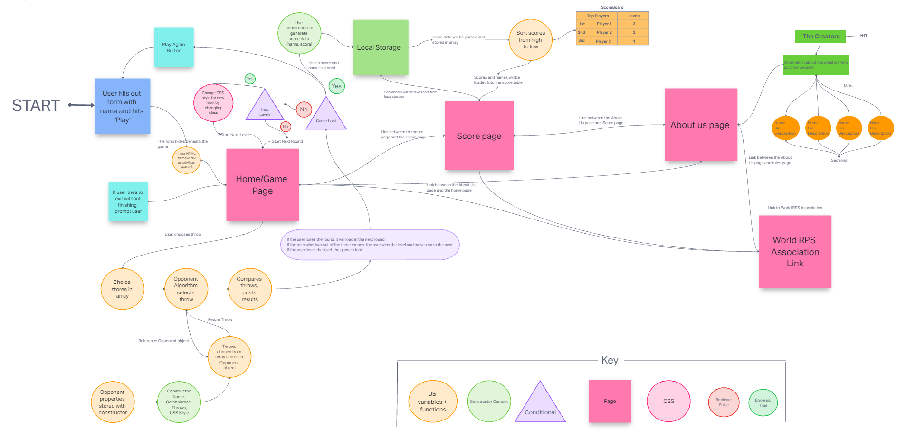

# Software Requirements

## Vision

The vision of this product is to provide an engaging and interactive rock-paper-scissors game that allows users to play against the computer or other players. It aims to deliver a fun and accessible gaming experience while staying true to the classic rules of rock-paper-scissors. The product seeks to entertain users and provide them with a simple yet enjoyable way to pass the time.

Our product offers a fun and engaging rock-paper-scissors game experience . You can play anytime, anywhere, without needing physical materials or opponents. With its user-friendly interface, you can enjoy playing against the computer or other players. The ability to play multiple rounds adds to the excitement. It's a simple and accessible game suitable for players of all ages and backgrounds, ensuring its wide appeal and enjoyment.

## Scope

* Glad Gaming will take user input of their throw and have a dynamic response to it.
* The game will allow the users to see the users selection and opponents selection.
* The game will allow users to track scores from previous games.
* Users will be able to compare their scores to other players.
* Users will be able to Play as many games as they want.

## Scope Out

* PVP User vs User gameplay.
* No Alternative throws(no Dynamite).

## MVP

* A single opponent who will throw a random genorated throw.
* 3 successfull rounds of one level.
* Unlimited levels.
* A form that the user fills out with just their name
* Link to the World RPS association rules page.
* Scores page with table chart.

## Stretch Goal

* Different bot for each level(We're aiming for this one).
* Changing the number of rounds per level.
* Our own Rules page.
* More animations(We're aiming for this one as well).
* dynamic style of each level (We're aiming for this one as well).
* Last bot mimic the users throw with one exception.

## Functional Requirements

* A user can summit a form with their name.
* A user can play the game.
* A user can view their previous scores and compare them with other players scores.
* A user can view our About us page.

## Data Flow

User begins using the app:

    * The user opens the website.
    * The user is presented with the main menu and prompted to enter their name.
    * Their name is stored in order to be displayed in the score table.

User selects to play rock-paper-scissors:

    * The user clicks on the "Play" button or selects the rock-paper-scissors game option.
    * The game interface is displayed, showing the user's choices (rock, paper, or scissors) and the computer opponent's choice.

User makes a choice:

    * The user selects their choice (rock, paper, or scissors) by clicking on the corresponding button or option.
    * The user's choice is recorded by the system.

System generates computer opponent's choice:

    * The system generates a random choice (rock, paper, or scissors) for the computer opponent.
    * The computer opponent's choice is recorded by the system.

Determine the winner:

    * The system compares the user's choice and the computer opponent's choice to determine the winner.
    * The game outcome (win, lose, or tie) is determined.

Update the score:

    * The system updates the user's score based on the game outcome (incrementing wins, losses, or ties) and adds the score to the score table.

Display game results:

    * The game results are shown to the user, indicating whether they won, lost, or tied the round.
    * The updated score is displayed to the user.

User decides to play again or exit:

    * The user is presented with options to play again or exit the game.
    * If the user chooses to play again, the game returns to step 3, allowing them to make a new choice.
    * If the user chooses to exit, the game ends, and they return to the main menu or exit the application.

## UML

